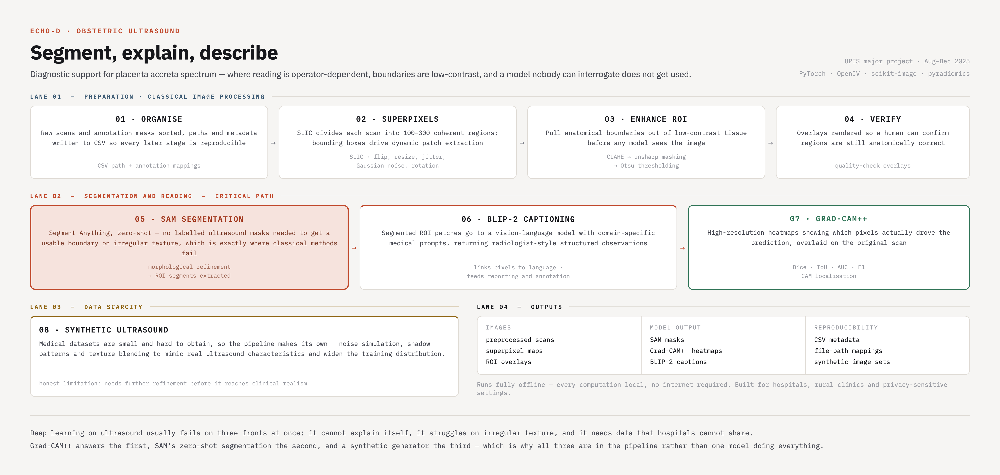

# Echo-D

Diagnostic support for obstetric ultrasound — segmentation, explanation and structured
description, built around **placenta accreta spectrum (PAS)** detection.

---

## The problem

Ultrasound is the workhorse of obstetric imaging because it is safe, cheap and real-time. It is
also operator-dependent, noisy, and full of low-contrast anatomical boundaries — which makes
assessment inconsistent exactly where consistency matters most, as in PAS, where early detection
changes outcomes.

Deep learning should help. In practice it fails on three fronts at once:

| Limitation | Why it blocks clinical use |
|---|---|
| **No interpretability** | A prediction a clinician cannot interrogate is one they will not act on |
| **Poor segmentation on irregular texture** | Classical methods break down on real ultrasound speckle |
| **Dependence on large datasets** | Medical data is small, sensitive, and rarely shareable |

Echo-D answers each one with a different component rather than asking a single model to do
everything.

## Pipeline

Nine stages, from raw scan to structured output.

| # | Stage | What it does |
|---|---|---|
| 01 | **Organise** | Raw scans and annotation masks sorted; paths and metadata written to CSV so every later stage is reproducible |
| 02 | **Superpixels** | SLIC divides each scan into 100–300 coherent regions; bounding boxes drive dynamic patch extraction, with flip, resize, jitter, Gaussian noise and rotation |
| 03 | **Enhance ROI** | CLAHE → unsharp masking → Otsu thresholding, pulling anatomical boundaries out of low-contrast tissue before any model sees the image |
| 04 | **Verify** | Overlays rendered so a human can confirm regions are still anatomically correct |
| 05 | **Segment** | **Segment Anything (SAM)**, zero-shot — no labelled ultrasound masks needed to get a usable boundary on irregular texture, with morphological refinement |
| 06 | **Describe** | **BLIP-2** receives SAM-segmented ROI patches plus domain-specific medical prompts, returning radiologist-style structured observations |
| 07 | **Explain** | **Grad-CAM++** produces high-resolution heatmaps showing which pixels actually drove the prediction, overlaid on the original scan |
| 08 | **Synthesise** | A synthetic ultrasound generator — noise simulation, shadow patterns, texture blending — widens the training distribution where real data is scarce |
| 09 | **Export** | Preprocessed images, superpixel maps, SAM masks, ROI overlays, Grad-CAM++ heatmaps, BLIP-2 captions and synthetic sets, with CSV metadata throughout |

## Evaluation

Dice, IoU, AUC, F1 and CAM localisation metrics — segmentation quality and explanation quality
measured separately, since a correct mask with a nonsensical heatmap is not a clinically usable
result.

## Offline by design

Every computation runs locally. No internet, no external API, no data leaving the machine — which
is what makes it deployable in hospitals, rural clinics and privacy-sensitive settings, where
sending patient imaging to a cloud endpoint is not an option.

## Stack

PyTorch · OpenCV · scikit-image · pyradiomics · Segment Anything · BLIP-2 · Grad-CAM++

Runs on Linux, Windows and Google Colab, with GPU support where available.

## Honest limitations

- **The synthetic generator needs refinement.** It produces ultrasound-*like* images; it does not
  yet reach clinical realism, and should be treated as augmentation rather than data.
- **Evaluation is on the project dataset**, not a multi-site clinical benchmark.
- **This is research work, not a medical device.** It is a diagnostic *support* pipeline intended
  to sit before human review, not to replace it.

## Documentation

The full specification — requirements, SWOT, architecture diagrams, DFDs, results — is in
[`MAJOR-PROJECT SRS REPORT FILE-2.pdf`](MAJOR-PROJECT%20SRS%20REPORT%20FILE-2.pdf).

## Credits

Major project, B.Tech Computer Science (AI & ML), University of Petroleum & Energy Studies,
Dehradun · August–December 2025.

Prince Yadav and Rajvardhan Singh Bhadauriya, under Dr. Kamakshi Rautela.
